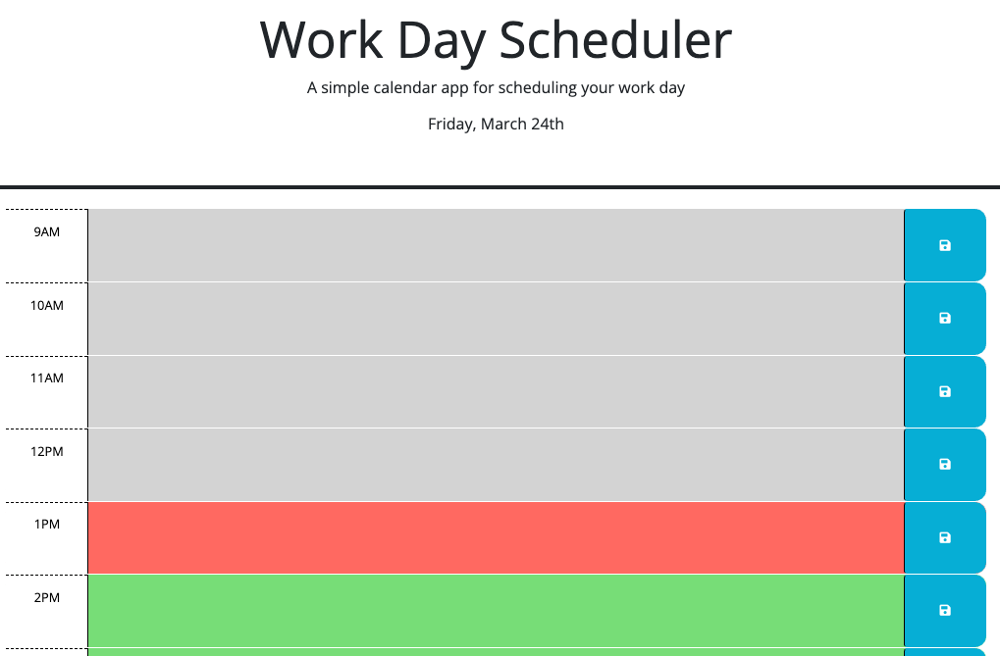
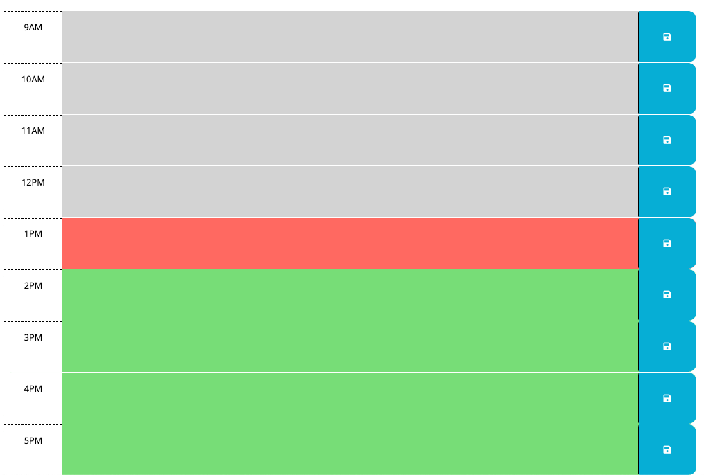
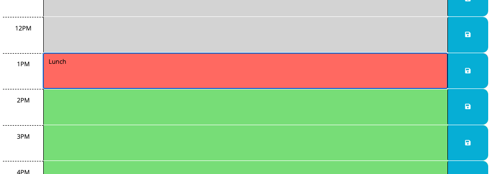
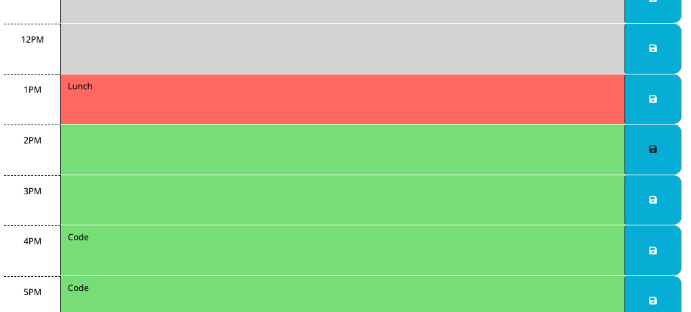

# Challenge 05 - Work Day Scheduler

## Project Description

The scheduler web app will help the end user keep track of their work schedule. It will visually inform them which events have ended, which event is currently taking place, and what their schedule looks like for the rest of the day. It also allows them to update their schedule on the fly and to come back to it throughout the day.

I used the following third party APIs/libraries to create this web app:
- Bootstrap
- Font Awesome
- Google Fonts
- jQuery
- Day.js

The library I used the most while building this app was jQuery. I am starting to feel more comfortable traversing and dynamically updating the DOM using the objects and methods available in this library as well as navigating its documentation. All in all it was a very fulfilling experience that kept me engaged as I noticed the progress I was making.

## Table of Contents
- [User Story](#user-story)
- [Acceptance Criteria](#acceptance-criteria)
- [Links](#links)
- [Screenshots](#screenshots)

## User Story

```
AS AN employee with a busy schedule
I WANT to add important events to a daily planner
SO THAT I can manage my time effectively
```

## Acceptance Criteria

```
GIVEN I am using a daily planner to create a schedule
WHEN I open the planner
THEN the current day is displayed at the top of the calendar
WHEN I scroll down
THEN I am presented with timeblocks for standard business hours
WHEN I view the timeblocks for that day
THEN each timeblock is color coded to indicate whether it is in the past, present, or future
WHEN I click into a timeblock
THEN I can enter an event
WHEN I click the save button for that timeblock
THEN the text for that event is saved in local storage
WHEN I refresh the page
THEN the saved events persist
```
 
## Links

To access the code repository and live website, use the links below:

- ### GitHub Repository URL
    https://github.com/sergiorodriguezdev/chl-05-work-day-scheduler
- ### GitHub Pages URL
    https://sergiorodriguezdev.github.io/chl-05-work-day-scheduler

## Screenshots







